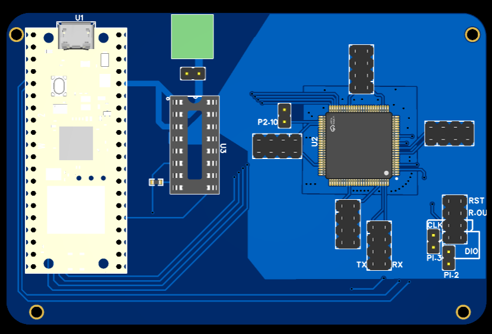

# Voltage glitcher test for LPC1768

Project Structure:

 - lpc/: contains all lpc codebase needed for the test
 - glitcher/: contains all pi2040 code for glitching


## Glitcher

The glitcher controller is pi2040. It uses the PIO interface to drive a single pin high or low at clock speed.

## LPC firmware

The lpc firmware does boot, put P0[26] LOW and start the target loop. Once finished P0[26] is raised HIGH again, and after a delay P0[26] is set to low again just before the target loop is executed again and so on.


## Stuff needed


- An LPC1768 board: **the target**
- MAX4619 chip for the glitching: **glitcher**
- Raspberry PI PICO 2040: **controller**


## Wiring

| LPC | PI2040 | MAX4619         |
|---|---|-----------------|
| GND | GND | GND,NC,X0,Y0,Z0 |
|  | VCC_EN | VCC             |
|  | 18 | EN              |
|  | 19 | A,B,C           |
| VCC |  | X,Y,Z           |
|  | VCC | X1,Y1,Z1        |
| P0.26 | 11 |                 |


## Settings

glitcher/glitch.c contains the following lines:

```c
#define PATTERN (0b111100000000000)
#define PATTERN_REPEAT 5
#define PATTERN_LENGTH 15
```

The pattern regulates when the glitch to GND is going to happen (1).

As of now this is the most stable without BO setting I could get. (no glitches yet with BO enabled)

Brown Out Detection can be disabled by connecting P2[13] of LPC1768 to GND upon boot.


---- 

Install: 
```bash

sudo apt install cmake gcc-arm-none-eabi libnewlib-arm-none-eabi libstdc++-arm-none-eabi-newlib
git submodule update --init --recursive
# add PICO_SDK_PATH to PATH
```

The board used for this repo is this one:  and could be found in the docs folder.


